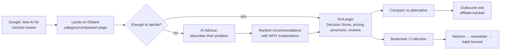

# 01 — Vision, Business & Product Strategy

## 1. Product Vision & Mission

**Company:** DStarix Techno Pvt Ltd (India)

**Mission:** Build the world's most trusted AI ecosystem that helps people discover, evaluate, compare, learn, and adopt AI technologies.

**Vision:** Become the _Google + G2 + Product Hunt + Gartner + GitHub + Hugging Face for Artificial Intelligence_ — the global reference people check before adopting any AI technology.

**Positioning (non-negotiable):** DStarix is an **AI Decision Platform**, never marketed as "10,000+ AI tools". The promise: _find the right AI tool in minutes, not hours._ The desired user reflex: _"Before choosing any AI product, I check DStarix."_

**Product evolution ladder** (from Knowledge_02):

```text
Directory → Recommendation Engine → Knowledge Platform → Decision Platform → Enterprise AI Intelligence Platform
```

Every architectural choice in this blueprint is evaluated against that ladder: does it move us up, and does it survive the climb?

### The three products

| Product                   | Purpose                        | Core surfaces                                                                                                                                                                              |
| ------------------------- | ------------------------------ | ------------------------------------------------------------------------------------------------------------------------------------------------------------------------------------------ |
| **DStarix AI** (flagship) | AI discovery & decision-making | Tools, Agents, Models, APIs, MCP Servers, Companies, Reviews, Comparisons, Collections, Workflows, Prompts, Templates, Deals, Benchmarks, Research, Discovery Engine, Advisor, Marketplace |
| **DStarix Learn**         | Learning platform              | Tutorials, Courses, Roadmaps, Projects, Assignments, Interview Prep, Certifications, Notes (Python, AI, Cloud, Data Science)                                                               |
| **DStarix Careers**       | Career platform                | AI Jobs, Resume Builder, Portfolio Builder, Company Profiles, Salary Insights, Interview Prep, Career Roadmaps                                                                             |

These are three _product surfaces_, not three companies. They share identity, design system, data (Companies appear in all three; Tools link to tutorials and jobs), and infrastructure. See [02-system-architecture.md](02-system-architecture.md).

## 2. Business Goals

### Goal hierarchy

1. **Years 0–1 (Trust & Traffic):** Become a top-3 organic search destination for AI tool decision queries ("best AI for X", "X vs Y", "X alternatives"). North-star input: organic sessions and search-success rate.
2. **Years 1–2 (Habit):** Convert visitors into returning users via accounts, bookmarks, collections, newsletter, and the AI Advisor. North-star: weekly returning users and decision-completion rate.
3. **Years 2–4 (Monetization depth):** Layer affiliate → premium → API → enterprise intelligence revenue on top of the trust asset. North-star: revenue per thousand sessions, enterprise pipeline.
4. **Years 4+ (Category ownership):** DStarix Decision Score becomes an industry-cited metric (as "G2 rating" is for SaaS). Enterprise AI Intelligence becomes the primary revenue engine.

### Revenue model & sequencing

The source documents list ten streams. Launching all ten at once would dilute focus; they are sequenced by dependency:

| Phase | Stream                                 | Why now                                        | Architectural dependency                                    |
| ----- | -------------------------------------- | ---------------------------------------------- | ----------------------------------------------------------- |
| 1     | Affiliate                              | Zero sales effort; monetizes traffic day one   | Outbound-link tracking, click attribution                   |
| 1–2   | Newsletter sponsorship                 | Monetizes email list early                     | Newsletter module, subscriber analytics                     |
| 2     | Display ads (limited)                  | Fills gaps; explicitly _not_ the business      | Ad slots in design system; never on decision-critical UI    |
| 2–3   | Sponsored listings                     | Directory traffic makes placements valuable    | Clearly-labeled sponsored flag (trust requirement), billing |
| 3     | Premium membership                     | Advisor + personalization give a reason to pay | Auth, entitlements, payments                                |
| 4     | Public API                             | Catalog + Decision Scores as data product      | API gateway, keys, metering, billing                        |
| 4     | Marketplace                            | Agents/prompts/templates commerce              | Payments, payouts, moderation                               |
| 4     | Enterprise plans & Market Intelligence | Requires data depth + brand authority          | Analytics warehouse, reporting, SSO/SAML                    |
| 4+    | Recruitment                            | Careers product liquidity                      | Jobs module maturity                                        |

**Trust guardrail (architecturally enforced):** sponsored placements are a distinct content type with a mandatory `sponsored: true` flag rendered by the design system — it is impossible to render a sponsored listing without the label. Decision Scores are never influenced by commercial relationships; the scoring service has no dependency on the billing module (enforced by module dependency rules, see 02).

## 3. Success Metrics

| Metric                   | Definition                                                                                    | Phase 1 target | Phase 3 target |
| ------------------------ | --------------------------------------------------------------------------------------------- | -------------- | -------------- |
| Organic traffic          | Monthly organic sessions                                                                      | 50K            | 2M             |
| Search success rate      | Searches ending in a result click or advisor session (no dead end)                            | > 60%          | > 80%          |
| Decision completion rate | Sessions reaching an "outbound visit", "bookmark", or "advisor recommendation accepted" event | > 8%           | > 20%          |
| Returning users          | 30-day returning visitor share                                                                | > 15%          | > 35%          |
| Bookmark rate            | Signed-in sessions that bookmark                                                              | > 5%           | > 12%          |
| Comparison usage         | Sessions viewing a comparison page                                                            | > 10%          | > 20%          |
| Newsletter growth        | Net new subscribers / month                                                                   | 1K             | 25K            |
| Affiliate revenue        | Monthly                                                                                       | covers infra   | ₹10L+          |
| Premium conversion       | Free → paid                                                                                   | —              | > 2%           |
| Enterprise leads         | Qualified/month                                                                               | —              | 20+            |

Instrumentation for every metric above is specified in the Analytics module ([07-modules.md §Analytics](07-modules.md)); no metric ships without its event being tracked from day one.

## 4. Primary User Journeys

### Journey A — The Decider (core journey, optimizes everything)



### Journey B — The Learner

Search/roadmap → tutorial or course on DStarix Learn → practices with recommended tools (cross-link to DStarix AI) → certification → portfolio (cross-link to Careers).

### Journey C — The Job Seeker

AI job listing (SEO) → company profile (shared entity with DStarix AI) → salary insights → resume builder → application → skill gap → course (cross-link to Learn).

### Journey D — The Vendor (supply side)

Claims company/tool listing → enriches data → responds to reviews → buys sponsored placement or posts jobs → enterprise intelligence customer. Vendors are the paying side of the marketplace; their journey is served by the vendor dashboard (Phase 3+).

The cross-links between journeys are the ecosystem moat: each product feeds the others' funnels. This is why shared identity and a shared entity graph (Companies, Tools, Skills) are platform-level requirements, not per-product features.

## 5. Conflicts & Gaps in the Source Documents — Identified and Resolved

The four source documents are strong on vision but conflict or under-specify in seven places. Per the mandate in `pmpt_1.md` ("challenge weak assumptions"), here is each conflict and the decision this blueprint takes. Full rationale in the corresponding ADRs (doc 09).

| #   | Conflict / gap                                                                                                                                                                                                                                               | Resolution (ADR)                                                                                                                                                                                                                                                  |
| --- | ------------------------------------------------------------------------------------------------------------------------------------------------------------------------------------------------------------------------------------------------------------ | ----------------------------------------------------------------------------------------------------------------------------------------------------------------------------------------------------------------------------------------------------------------- |
| C1  | **"Design for 100M+ users" vs ₹0–2K/month Phase-1 budget.** These are compatible only with an evolutionary architecture.                                                                                                                                     | Modular monolith on serverless/free tiers; every scaling step is additive (read replicas, cache tiers, service extraction), never a rewrite. (ADR-001)                                                                                                            |
| C2  | **Cloudflare Pages named as host, but the platform is Next.js.** Cloudflare has deprecated Pages for new projects in favor of Workers; full Next.js support on Cloudflare goes through the OpenNext adapter, which trails Vercel on newest Next.js features. | Deploy Next.js to **Cloudflare Workers via OpenNext** to honor the Cloudflare-first cost mandate, with Vercel as a documented fallback if adapter friction costs > 2 dev-days/month. Cloudflare stays authoritative for DNS/CDN/R2/security regardless. (ADR-008) |
| C3  | **Three websites vs SEO authority.** Splitting into three domains (or even three subdomains) at launch fragments domain authority exactly when SEO is the growth engine.                                                                                     | One root domain. Flagship at `dstarix.com`, Learn at `dstarix.com/learn`, Careers at `dstarix.com/careers`, served by separate apps behind path routing. Subdomain split becomes possible later (301s preserved) once authority is established. (ADR-009)         |
| C4  | **"Community" is listed as a required architecture area but no community product is defined in the docs.**                                                                                                                                                   | Community v1 = reviews, Q&A on tool pages, and public collections (assets that compound SEO + trust). Forums/discussions deferred to Phase 4 — flagged as an open product question. (§Community in doc 07)                                                        |
| C5  | **17 modules in the flagship product with no priority ordering beyond four coarse phases.**                                                                                                                                                                  | This blueprint assigns every module to a phase with explicit exit criteria (doc 09 roadmap). Benchmarks & Research are demoted to Phase 3 content types (not standalone systems) until data volume justifies more.                                                |
| C6  | **Payments unspecified; company is Indian, audience is global.** Stripe India has onboarding restrictions; global SaaS tax compliance is heavy.                                                                                                              | Dual-rail: **Razorpay** for INR, **Paddle (Merchant of Record)** for global premium/enterprise — MoR offloads global tax/GST/VAT. Marketplace payouts (Phase 4) re-evaluated separately (likely Stripe Connect or Razorpay Route). (ADR-011)                      |
| C7  | **"AI Content Automation" vs "human review before publishing".** Not a true conflict, but needs an enforcement mechanism, not a policy hope.                                                                                                                 | The content pipeline state machine has no transition from `ai_draft` to `published` that bypasses `editorial_review` for trust-critical content types. Enforced in the workflow engine, not convention. (doc 06 §Content pipeline)                                |

These resolutions are baked into the rest of the blueprint; each is revisitable through its ADR.
