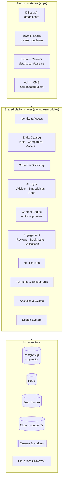
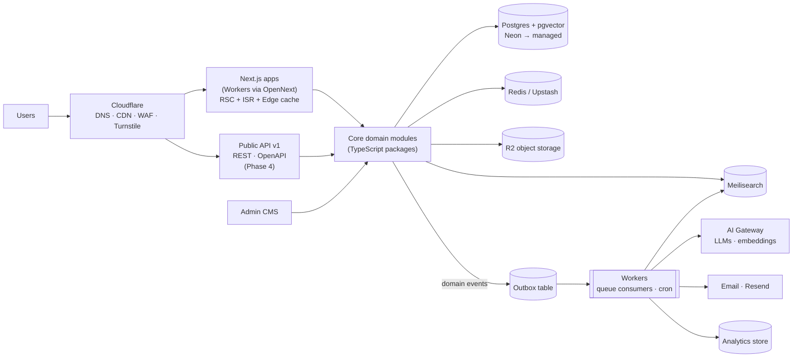
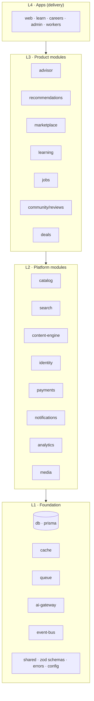
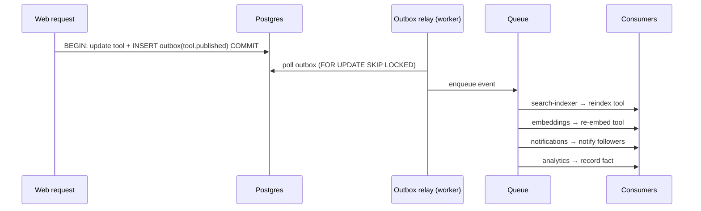

# 02 — Platform & System Architecture

## 1. Platform Architecture

DStarix is **one platform with three product surfaces**. The platform layer owns everything shared; products own only their unique domain logic and UI.

**Rule:** products never talk to each other directly — they integrate through shared platform modules and shared entities (a Company page on Careers renders data owned by the Catalog module; it does not query another app).

## 2. High-Level System Architecture

Key properties:

- **Stateless web tier.** All state lives in Postgres/Redis/R2 — web instances scale horizontally without coordination.
- **Read-heavy by design.** >95% of traffic is anonymous reads of catalog/content pages, absorbed by CDN + ISR + Redis before touching Postgres. This is what makes 10M users affordable.
- **Async by default for anything slow.** Indexing, embeddings, emails, AI drafting, analytics all run through the queue; user-facing requests never wait on them.
- **One source of truth.** Postgres is authoritative; search indexes, caches, and vector stores are derived and rebuildable projections.

## 3. Microservices vs Modular Monolith — Analysis & Decision

| Criterion                                             | Microservices                                            | Modular monolith                                                      | Winner for DStarix |
| ----------------------------------------------------- | -------------------------------------------------------- | --------------------------------------------------------------------- | ------------------ |
| Team size (1 founder → ~10 engs)                      | Heavy per-service overhead (deploys, contracts, on-call) | One deploy, one test suite                                            | Monolith           |
| Phase-1 budget (₹0–2K/mo)                             | Minimum viable footprint is $100s/mo                     | Fits free/serverless tiers                                            | Monolith           |
| Iteration speed pre-PMF                               | Cross-service changes are slow                           | Refactor freely inside boundaries                                     | Monolith           |
| Transactional integrity (reviews + scores + entities) | Sagas/eventual consistency everywhere                    | Local ACID transactions                                               | Monolith           |
| Independent scaling of hot paths                      | Native                                                   | Achievable: web vs worker split + per-route caching                   | Tie                |
| Fault isolation                                       | Native                                                   | Weaker; mitigated by queue isolation + timeouts                       | Microservices      |
| Future 100M-user scale                                | Proven                                                   | Proven **if boundaries stay clean** (Shopify, GitHub, Stack Overflow) | Tie                |

**Decision (ADR-001): Modular monolith with enforced module boundaries, plus a separately-deployed worker tier from day one.** Two deployables (web, workers) sharing one codebase.

**Extraction triggers** — a module is promoted to a standalone service only when one of these is measured, not predicted:

1. Its resource profile conflicts with the web tier (e.g. recommendation training jobs starving web CPU).
2. It needs a different runtime (e.g. Python for ML ranking).
3. A dedicated team owns it and deploy coupling causes real contention.
4. Its failure blast radius must be isolated (e.g. public API tier so partner traffic can't degrade the site).

Expected first extractions (Phase 4, if triggered): `search-indexer`, `ai-gateway`, `public-api`.

## 4. Module Map & Dependency Rules

Modules are TypeScript packages with explicit public interfaces. Dependency direction is enforced by lint rules (`eslint-plugin-boundaries` + `dependency-cruiser` in CI) — an illegal import fails the build.

Rules:

1. Dependencies point **downward only**. L2 never imports L3; nothing imports from apps.
2. Same-layer modules communicate via **domain events** or via a lower-layer interface — never direct imports (e.g. `reviews` doesn't import `catalog`; it emits `review.approved`, and `catalog` recomputes the Decision Score in its own consumer).
3. **Decision-score integrity:** `catalog` (which owns scores) may never depend on `payments` — commercial state cannot influence scoring (see 01 §Trust guardrail).
4. Each module exposes `index.ts` (public API) — deep imports are lint-blocked.

## 5. Event-Driven Architecture

**Pattern: transactional outbox → queue → consumers.** Writing a domain change and its event in one Postgres transaction guarantees no lost events; a relay drains the outbox to the queue.

**Event catalog (initial):** `tool.published`, `tool.updated`, `tool.claimed`, `review.submitted`, `review.approved`, `user.registered`, `bookmark.created`, `collection.published`, `comparison.viewed`, `deal.published`, `subscription.activated`, `subscription.canceled`, `course.completed`, `job.posted`, `application.submitted`, `content.draft_ready`, `content.approved`, `search.zero_results`.

Conventions: events are versioned (`tool.published.v1`), validated with shared Zod schemas, carry `id`, `occurredAt`, `actor`, and are **facts, not commands**. Consumers are idempotent (event `id` dedupe) because the queue guarantees at-least-once delivery.

## 6. Queues & Background Jobs

**Phase 1: `pg-boss` (Postgres-backed queue).** Zero extra infrastructure, transactional enqueue in the same DB, exactly the scale we need (<100 jobs/min). **Phase 3+: migrate high-volume topics to BullMQ (Redis) or Cloudflare Queues** behind the same `queue` interface — the abstraction in L1 makes this a config change for producers/consumers. (ADR-006)

| Job class            | Examples                                                                                                         | Priority / SLA         |
| -------------------- | ---------------------------------------------------------------------------------------------------------------- | ---------------------- |
| Interactive-adjacent | send verification email, invalidate cache tag                                                                    | seconds                |
| Projection sync      | search reindex, embedding refresh, score recompute                                                               | < 1 min                |
| Content pipeline     | AI draft generation, enrichment, screenshot capture                                                              | minutes                |
| Scheduled (cron)     | sitemap regeneration, trending recompute, deal expiry, digest emails, dead-link checker, affiliate report import | hourly/daily           |
| Heavy batch          | full reindex, bulk imports, analytics rollups                                                                    | off-peak, rate-limited |

Worker tier rules: every job idempotent, bounded retries with exponential backoff, dead-letter queue with alerting, per-job timeout, and per-provider concurrency caps (protects LLM API budgets).
