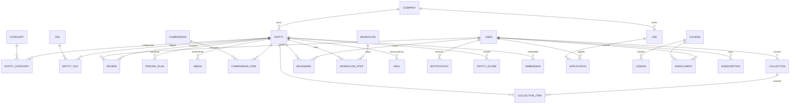
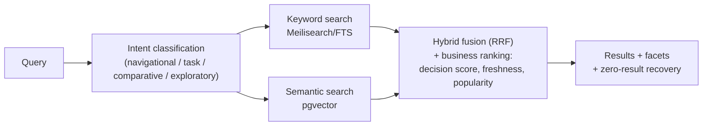
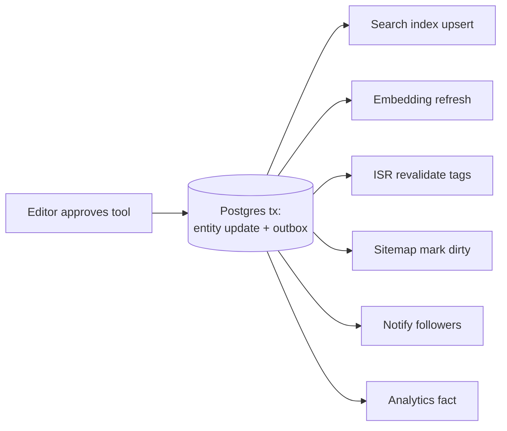

# 05 — Data Architecture

## 1. Database Architecture

**PostgreSQL as the single authoritative store** (ADR-002), with `pgvector` for embeddings. Phase 1 on Neon serverless (free tier, branching for preview envs, PITR); Phase 3+ on a managed dedicated Postgres with read replicas. Prisma as ORM (matches the docs; migrations + type safety), with the explicit rule that **hot-path queries may drop to raw SQL** behind repository interfaces when Prisma's generated SQL underperforms.

**Entity-first design** (per Knowledge docs): the catalog is one polymorphic-free, explicit schema — every entity type (tool, agent, model, api, mcp_server) shares an `entities` core with type-specific extension tables, rather than a generic `jsonb` blob or a table per type with duplicated columns. Rationale: shared behavior (slugs, scores, reviews, bookmarks, search) is written once; type-specific attributes stay queryable and constrained.

### Core ER diagram

### Schema conventions

- IDs: UUIDv7 (time-ordered → index-friendly) primary keys; public URLs use immutable `slug` with a `slug_redirects` table for renames (SEO 301 discipline).
- `created_at`/`updated_at` everywhere; **soft delete (`deleted_at`) only where recovery/audit matters** (users, reviews, entities); hard delete for derived rows.
- Money as integer minor units + currency code — never floats.
- Status fields are Postgres enums with CHECK-constrained state machines (e.g. entity: `draft → in_review → published → archived`).
- Denormalized aggregates (review counts, avg rating, bookmark counts, decision score) live in `entity_scores`, recomputed by event consumers — reads never aggregate on the fly. This is deliberate, contained denormalization; everything else stays normalized per the docs' "no duplicated data" rule.
- Every table's index set is designed with its query patterns (documented per module); composite indexes for hot filters (`(category_id, decision_score DESC)`), partial indexes for statuses, GIN for FTS columns.

### Scale plan (10M → 100M users)

| Lever                                                                           | When                                     |
| ------------------------------------------------------------------------------- | ---------------------------------------- |
| Connection pooling (PgBouncer/Neon pooler) — mandatory with serverless web tier | Day 1                                    |
| Read replicas for catalog reads (repositories are read/write-split-ready)       | Phase 3                                  |
| Partitioning: `analytics_events`, `audit_log`, `notifications` by month         | When > ~50M rows                         |
| Extract analytics events to ClickHouse/Tinybird                                 | Phase 3–4 (doc 07 §Analytics)            |
| Per-module logical DBs (catalog vs identity vs analytics)                       | Only with service extraction (doc 02 §3) |

Sharding user data is **not** planned: a catalog/content platform's relational core fits comfortably in one large Postgres + replicas at 100M-user traffic because reads are cache-absorbed; the append-heavy stores (analytics) leave Postgres instead.

## 2. Caching Strategy (layered; each layer absorbs the next)

| Layer                    | Tech               | Caches                                                                                                              | TTL / invalidation                                                                                     |
| ------------------------ | ------------------ | ------------------------------------------------------------------------------------------------------------------- | ------------------------------------------------------------------------------------------------------ |
| 1. Browser/CDN           | Cloudflare edge    | Static assets, images, ISR HTML                                                                                     | Immutable assets (hashed); HTML via s-maxage + stale-while-revalidate                                  |
| 2. ISR / Next data cache | Next.js cache tags | Rendered pages, RSC data                                                                                            | **Event-driven on-demand revalidation**: `tool.updated` → revalidate tags `tool:{id}`, `category:{id}` |
| 3. App cache             | Redis (Upstash)    | Search results (popular queries), trending lists, recommendation slates, session-adjacent data, rate-limit counters | Short TTLs (1–15 min) + tag invalidation                                                               |
| 4. DB                    | Postgres           | Prepared plans, hot pages in RAM                                                                                    | n/a                                                                                                    |

Rules: cache keys are versioned + namespaced (`v1:trending:tools:global`) · stampede protection via single-flight locks for expensive recomputes · **cache is always a projection** — losing Redis degrades latency, never correctness · negative caching for 404 slugs (scraper protection) · explicit "do not cache" list: anything personalized, entitlement, or payment-related.

## 3. Search Architecture

Phased, behind one `search` module interface (ADR-003):

- **Phase 1: Postgres native.** FTS (`tsvector` + trigram for typo-ish matching) for keyword; `pgvector` HNSW for semantic. Zero extra infra; fine to ~100K entities and low QPS.
- **Phase 2: Meilisearch** (self-hosted, one small VPS ~₹800/mo) for keyword/faceted/typo-tolerant/instant search — best relevance-out-of-the-box per ops-hour among Meilisearch/Typesense/OpenSearch (comparison in ADR-003). pgvector stays for semantic.
- **Phase 4 (if metrics demand): managed cluster** (Meilisearch Cloud / Typesense Cloud / OpenSearch) — swap stays behind the interface.

**Query pipeline** (the "AI Discovery Engine" — full AI detail in doc 06):

**Indexing pipeline:** event-driven (`tool.published` → indexer job → upsert doc + refresh embedding). Index documents are denormalized read models (name, summary, categories, pricing flags, score, popularity) rebuilt from Postgres at any time (`reindex-all` job). Zero-result queries are logged as events — they feed both content gap analysis and synonym curation.

## 4. File & Media Storage

- **Cloudflare R2** for all objects (zero egress fees — decisive vs S3 for an image-heavy public site): entity screenshots/logos, user avatars, course assets, resume PDFs, OG images.
- Buckets: `public-media` (behind Cloudflare CDN with image resizing/AVIF on the fly) and `private-files` (resumes, invoices — presigned URL access only, short expiry).
- **Upload flow:** client → presigned upload URL (size/MIME-constrained) → R2 → `media` DB row (`pending`) → worker validates (magic bytes, image re-encode to strip payloads/EXIF, dimension caps, malware scan for user PDFs) → `ready`. Nothing user-uploaded is served unvalidated.
- Naming: content-hash keys (dedupe + immutable caching); DB `media` table is the metadata authority (owner, entity link, variants, alt text — alt text required, accessibility).

## 5. Key Data Flows

### Content publish → everywhere

### Review lifecycle

`submitted` → spam/abuse screen (heuristics + AI moderation assist) → moderation queue (auto-approve trusted reviewers) → `approved` → event → score recompute + page revalidation + vendor notification. One transaction per transition; every transition audited.
