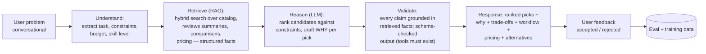

# 06 — AI Architecture

The AI layer is the product differentiator — it is what turns a directory into a Decision Platform. It is also the biggest variable cost, so every AI feature runs through one governed gateway.

## 1. AI Gateway (`packages/ai-gateway`)

A single internal abstraction wrapping all model providers. **No module calls a provider SDK directly** — lint-enforced.

Responsibilities:

- **Provider abstraction & model registry:** logical model names (`embed-default`, `advisor-reasoner`, `draft-writer`, `moderation-screen`) mapped to concrete providers in config. Providers: Anthropic Claude (reasoning/advisor/drafting quality), Cloudflare Workers AI (cheap embeddings + classification at the edge, Cloudflare-first cost alignment), OpenAI embeddings as alternative. Swapping providers = config change + eval run, no code change.
- **Cost control:** per-feature budgets, per-user/IP rate limits, token accounting persisted per request (feature, model, tokens, cost) → cost dashboards; hard monthly circuit breakers so a traffic spike can't create a surprise bill.
- **Caching:** exact + semantic caching of completions where safe (advisor answers to near-identical questions, draft sections); embedding cache keyed by content hash.
- **Reliability:** timeouts, retries with fallback model chains (`advisor-reasoner` → smaller model → graceful degraded UX), streaming pass-through.
- **Prompt management:** prompts are versioned artifacts in the repo (`prompts/` with schema-validated variables), never inline strings; every response logs `prompt_version` for regression tracing.
- **Evals as CI:** golden-set eval suites per feature (advisor quality, draft factuality, intent accuracy) run on prompt/model changes — AI changes get the same gate as code changes.

## 2. Embeddings & Semantic Layer

- Every published entity, category, workflow, course, and job gets an embedding (content-hash triggered refresh via the event pipeline, doc 05 §3).
- Store: `pgvector` HNSW (ADR-003) — same store as the relational truth, enabling SQL-joinable vector queries (e.g. _nearest tools WHERE pricing='free' AND category='legal'_ in one query). Dedicated vector DBs (Pinecone/Qdrant) rejected at this scale: extra infra + sync complexity for no measurable win under ~5M vectors.
- Powers: semantic search, "similar tools", internal-link engine (doc 03 §4), advisor retrieval, recommendation candidates.

## 3. AI Discovery Engine (semantic search + intent)

Pipeline detailed in doc 05 §3. AI-specific parts:

- **Intent detection:** small/cheap classifier (Workers AI or heuristics+embedding prototypes) labels queries `navigational | task | comparative | exploratory` and extracts entities (category, budget, platform). Task queries ("summarize research papers") weight semantic retrieval and can hand off to the Advisor; navigational ("ChatGPT") weight keyword.
- **Zero-result recovery:** semantic nearest-neighbors + "describe your problem to the Advisor" handoff — search never dead-ends (search-success metric is a north star).
- **Personalization (Phase 3):** signed-in users' category affinities (from bookmarks/views) re-rank results modestly; never overrides relevance, always inspectable ("because you viewed…").

## 4. AI Advisor (flagship, Phase 3)

Users describe a problem; DStarix recommends tools/workflows **with explicit reasoning**.

Architectural commitments:

- **Grounded-only:** the model recommends exclusively from retrieved catalog candidates (IDs validated against DB post-generation) — the Advisor can never hallucinate a tool or a price. Facts (pricing, platforms) are injected as structured data, not prose.
- **Explainability is schema-enforced:** the output contract requires `reasons[]`, `tradeoffs[]`, `evidence_refs[]` per recommendation; UI renders them. A recommendation without a why fails validation.
- **Prompt-injection defense:** catalog/review text entering the context is treated as data (delimited, instruction-stripped); the Advisor has no tools that mutate state; output length/URL allowlists enforced.
- **Cost shape:** anonymous users get N advisor sessions (Turnstile-gated); premium unlocks more — the Advisor is both the flagship feature and the premium hook.
- Conversation state in Postgres (resumable, analyzable); accepted/rejected feedback becomes eval + future ranking training data.

## 5. Recommendation Engine (phased honesty: heuristics → ML)

| Phase | Approach                                                                                                                                                           | Surfaces                              |
| ----- | ------------------------------------------------------------------------------------------------------------------------------------------------------------------ | ------------------------------------- |
| 1     | Deterministic: same-category + embedding similarity + score/popularity ordering; trending = time-decayed engagement counts (cron)                                  | Similar tools, trending, editor picks |
| 3     | Add collaborative filtering ("users who bookmarked X also…") from first-party events; personalized home/email slates from category affinities                      | Home feed, digests, "for you"         |
| 4     | Learned ranking (train on outbound-click/bookmark conversions; likely a Python batch job — first candidate for the polyglot-service extraction trigger, doc 02 §3) | All slates                            |

Invariants from day one: every rec response carries a `reason` ("similar to X", "popular in Legal AI this week") rendered in UI; recommendation reads are precomputed slates from Redis/DB (never inline ML at request time); sponsored items are injected by a separate, labeled slot system — never mixed into organic rankings (trust guardrail, doc 01).

## 6. Content Engine & AI Automation

The `Discover → Verify → AI Draft → Editorial Review → Publish → SEO → Analytics` pipeline is a **state machine owned by the content-engine module**, with AI as a worker inside it — not an autopilot.

- **Discover:** source watchers (Product Hunt/GitHub/HF/company blogs/sitemap diffs) create `discovery` candidates with provenance.
- **Verify:** dedupe against catalog (fuzzy + embedding match), liveness checks, company matching; editors confirm identity.
- **AI Draft:** drafting jobs generate structured entity content (summary, features, use cases, pros/cons, FAQ) _with citations to scraped sources_; every AI field is marked `ai_generated: true` until human-edited.
- **Editorial Review:** queue in Admin CMS — diff view, fact-check checklist, one-click accept/edit per field. **The state machine has no `ai_draft → published` transition for trust-critical types** (entities, comparisons, benchmarks); low-risk types (tag descriptions) may auto-publish with sampling review. This mechanically enforces the docs' human-review mandate (conflict C7).
- **Post-publish:** freshness SLAs per content type (pricing rechecked monthly; dead-link checker; `last_verified_at` shown on pages — a visible trust signal), plus AI-assisted change detection that reopens review when a vendor's pricing page changes.
