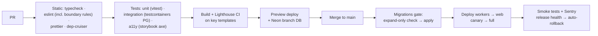

# 08 — Infrastructure, Security & Operations

## 1. Security Architecture

**Threat model priorities for this product:** content scraping/abuse, review fraud, credential stuffing, spam, prompt injection (Advisor), payment fraud, and — as revenue grows — vendor pressure on data integrity. Defense in depth:

| Layer          | Controls                                                                                                                                                                                                                                                                                                                |
| -------------- | ----------------------------------------------------------------------------------------------------------------------------------------------------------------------------------------------------------------------------------------------------------------------------------------------------------------------- |
| Edge           | Cloudflare WAF + managed rules, bot management, Turnstile on auth/review/advisor endpoints, per-route rate limits, DDoS absorption                                                                                                                                                                                      |
| Transport      | TLS everywhere, HSTS preload                                                                                                                                                                                                                                                                                            |
| App            | Strict security headers (CSP with nonces, frame-ancestors none, referrer-policy), CSRF protection on mutations (same-site cookies + origin checks on server actions), output encoding (React default) + sanitization for MDX/user HTML, SSRF allowlists for all outbound fetchers (source watchers, screenshot workers) |
| API            | Zod validation on every boundary, authz in application layer (doc 04 §5), idempotency keys, quota enforcement                                                                                                                                                                                                           |
| Data           | Parameterized queries only (Prisma), least-privilege DB roles (app vs worker vs migration), encryption at rest (provider) + field-level encryption for sensitive PII, secrets in platform secret stores (never in repo; rotation runbook)                                                                               |
| AI             | Prompt-injection defenses (doc 06 §4), no state-mutating tools for user-facing LLMs, AI cost circuit breakers                                                                                                                                                                                                           |
| People/process | 2FA-mandatory admin, audit log on all admin mutations, dependency scanning (Renovate + `pnpm audit` + CodeQL in CI), incident-response runbook, principle of least privilege on cloud accounts                                                                                                                          |

**Privacy & compliance:** India DPDP Act + GDPR readiness from day one (we will have EU traffic): consent management, privacy policy honesty, data-subject export/delete endpoints (soft-delete → purge jobs), data minimization (no third-party trackers, IP truncation), records-of-processing doc. PCI scope avoided entirely — card data never touches our servers (hosted checkout pages of Razorpay/Paddle).

## 2. Scalability Strategy

The scalability model is **shed load before it costs money**:

```text
100 requests → ~95 terminate at CDN/ISR cache (₹0 marginal)
            →  ~4 hit Redis-cached app reads (cheap)
            →  ~1 reaches Postgres (the only tier that needs care)
```

Levers in order of activation (all designed-in from day one, activated by metrics): CDN/ISR coverage ratio → Redis cache breadth → DB connection pooling → read replicas → search offload to Meilisearch → analytics offload to ClickHouse → worker fleet scaling → service extraction (doc 02 §3 triggers). Web tier is stateless/serverless — horizontal scale is automatic; the deliberate bottleneck order is: Postgres write master last.

Capacity sanity check at 10M monthly visitors (~30M page views): ~12 req/s average, ~60 req/s peak origin traffic _after_ 95% cache termination ≈ trivially served by serverless Next.js + one well-indexed Postgres with a replica. The architecture's 100M path is more cache + replicas + extracted hot services, not a redesign.

## 3. High Availability & Disaster Recovery

| Phase | Availability posture                                                                                                                                                                                           | RPO / RTO                                       |
| ----- | -------------------------------------------------------------------------------------------------------------------------------------------------------------------------------------------------------------- | ----------------------------------------------- |
| 1–2   | Single-region managed services (Neon HA storage, Upstash replicated, R2 multi-DC by design); CDN serves stale-while-revalidate during origin blips — **static-heavy design is itself an availability feature** | RPO ≤ 5 min (PITR), RTO ≤ 4 h (runbook restore) |
| 3     | Managed Postgres with standby failover, worker redundancy, Meilisearch snapshot + rebuild-from-Postgres (projections are expendable)                                                                           | RPO ≤ 5 min, RTO ≤ 1 h                          |
| 4+    | Multi-region read replicas + regional edge rendering; active-active only if enterprise SLAs demand                                                                                                             | RPO ≈ 0, RTO ≤ 15 min                           |

Non-negotiables from day one: automated daily backups + PITR, **quarterly restore drills** (a backup is a hope until restored), infrastructure reproducible from code, DNS/CDN config exported, `status.dstarix.com` (external status page), incident runbooks in `docs/runbooks/`.

## 4. Performance Optimization Strategy (whole-system)

Frontend budgets in doc 03 §7. System-side: p95 origin response < 300ms for dynamic routes, search < 200ms, advisor first-token < 2s (streamed). Method: performance budgets in CI (Lighthouse CI) + production RUM (Core Web Vitals) + per-query DB monitoring (`pg_stat_statements`, slow-query alerts) + load tests (k6) before each phase gate. Optimization is metric-driven — no speculative micro-optimization (cost tenet).

## 5. Monitoring & Observability

- **Errors:** Sentry (web + workers), release-tagged, alert on new-issue/regression.
- **Traces/metrics:** OpenTelemetry instrumentation from day one (request → module → DB/queue spans, `request-id` correlated); export to Grafana Cloud free tier (Phase 1) → self-hosted LGTM stack if cost dictates later.
- **Golden signals + product SLOs:** availability 99.9%, search success rate, queue depth/DLQ age, outbox lag, ISR revalidation failures, AI spend per feature per day, affiliate click delivery. Alerting: page on user-facing breach (uptime, checkout, auth); ticket on the rest — alert fatigue is a real failure mode for a tiny team.
- **Uptime:** external probes (BetterStack/UptimeRobot) on home, tool page, search, auth, checkout.

## 6. Logging Strategy

Structured JSON logs (pino) everywhere; levels used honestly (`error` pages someone, `warn` is actionable, `info` is state changes, `debug` off in prod). Every log line carries `request-id`/`job-id`, module, and actor-id (never PII payloads, never secrets/tokens — lint + redaction middleware). Sinks: Cloudflare Workers Logs / Axiom free tier → retention 30d hot, 1y cold (R2 export) for audit-relevant logs. Audit log (doc 04 §5) is a DB table, not a log stream — queryable and durable.

## 7. CI/CD Pipeline

GitHub Actions + Turborepo remote caching:



Rules: trunk-based development, every merge deployable · **expand/contract migrations only** (no breaking column drops in the same release as code that stops using them) · E2E (Playwright) on the critical paths (search → tool page → outbound; auth; checkout) nightly + pre-release · feature flags for risky launches (simple DB-backed flags service, no vendor yet) · secrets via environment stores, per-env isolation (dev/preview/prod).

## 8. Infrastructure & Cloud Deployment Strategy (Cloudflare-first, ADR-008)

| Concern        | Phase 1 (₹0–2K/mo)                                                            | Phase 3 (₹25–60K/mo)                 | Phase 4+                                                              |
| -------------- | ----------------------------------------------------------------------------- | ------------------------------------ | --------------------------------------------------------------------- |
| Web apps       | Cloudflare Workers (OpenNext) free/paid tier                                  | Workers paid, higher limits          | Workers / hybrid; consider dedicated SSR fleet only if metrics demand |
| DNS/CDN/WAF    | Cloudflare free                                                               | Cloudflare Pro/Business              | Enterprise if SLA needed                                              |
| Postgres       | Neon free (pooled, PITR, branching)                                           | Neon Scale / managed PG + replica    | Dedicated managed PG, multi-region replicas                           |
| Redis          | Upstash free                                                                  | Upstash pay-as-you-go                | Managed/self-hosted Redis                                             |
| Search         | Postgres FTS + pgvector (no infra)                                            | Meilisearch on 1 VPS (Hetzner ~₹800) | Managed search cluster                                                |
| Objects/media  | R2 free tier + image resizing                                                 | R2                                   | R2                                                                    |
| Workers/queues | pg-boss inside a small always-on worker (Railway/Fly ~₹500 or CF cron+queues) | Dedicated worker VPS/containers      | Autoscaled worker fleet                                               |
| Email          | Resend free                                                                   | Resend paid                          | Resend/SES                                                            |
| AI             | Workers AI free quota + metered Anthropic                                     | Metered, budget-capped               | Volume deals                                                          |

IaC: Phase 1 = documented config + `wrangler`/provider CLIs committed in repo; Phase 3 = Terraform for everything non-trivial (DB, DNS, buckets, monitors). No Kubernetes on the roadmap until multiple extracted services + a platform engineer exist — containers-on-managed-hosts cover Phase 4.

## 9. Cost Optimization Strategy

- The **architecture is the cost strategy**: static-first rendering, zero-egress R2, serverless idle-scale-to-zero, Postgres-backed queue (no extra broker), pgvector (no vector DB vendor), first-party analytics (no per-seat SaaS).
- AI spend is the top variable-cost risk → gateway budgets/circuit breakers + caching + small-model routing (doc 06 §1) and monthly per-feature cost review.
- Guardrails: billing alerts on every provider at 50/80/100% of phase budget; monthly cost review against the phase table (Knowledge_02's ₹ budgets are encoded as the phase gates in doc 09); "scale only when metrics justify" is a standing rule — every infra upgrade PR must cite the metric that demands it.
